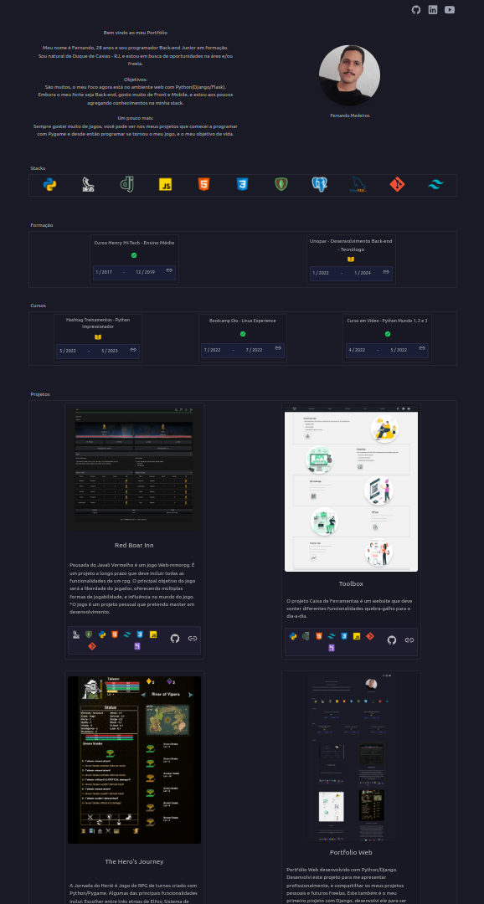

    
        
    
    
    
    
    

 

# Portfolio-Web

### PT
Portfólio Web desenvolvido com Python/Django.

Desenvolvi este projeto para me apresentar profissionalmente, e compartilhar os meus projetos pessoais e futuros freelas.

Este também é o meu primeiro projeto com Django, desenvolvi ele para ser escalável para novos projetos, formações, especializações e tecnologias, sendo apenas necessário entrar no Admin e persistir novos dados, e para isso estou utilizando banco de dados PostgreSql do Google Cloud Sql.

 

### EN
Web Portfolio powered by Python/Django.

I developed this project to present myself professionally, and share my personal and future freelance projects.

This is also my first project with Django, I developed it to be scalable for new projects, formations, specializations and technologies, being only necessary to enter the Admin and persist new data, and for that I am using Google Cloud Sql's PostgreSql database.

## HomePage

    

